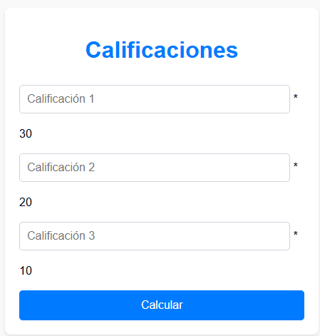
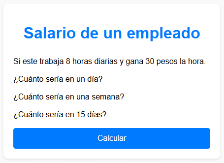

# Calculadora de Calificaciones y Salarios

Esta actividad consiste en dos aplicaciones web interactivas que permiten a los usuarios calcular calificaciones ponderadas y salarios. La primera aplicación calcula el resultado ponderado de tres calificaciones ingresadas por el usuario. La segunda calcula el salario diario, semanal y quincenal de un empleado basado en horas trabajadas y tarifa por hora. Este proyecto demuestra habilidades en HTML, CSS y PHP para la creación de formularios interactivos y procesamiento de datos del lado del servidor.

  

Archivo: **ejercicio1.php**

- **HTML:** Define la estructura de la página con un formulario para ingresar tres calificaciones. Cada calificación tiene un peso diferente en el cálculo final.

- **PHP:** Procesa los datos del formulario, calcula los resultados ponderados y muestra los resultados en pantalla.

  

Archivo: **ejercicio2.php**

- **HTML:** Define la estructura de la página con un formulario para calcular el salario diario, semanal y quincenal basado en horas trabajadas y tarifa por hora.

- **PHP:** Procesa los datos del formulario, calcula los salarios y muestra los resultados en pantalla.

Esta actividad demuestra habilidades en la creación de formularios web, procesamiento de datos con PHP y presentación de resultados con un diseño limpio y profesional.

**Consulta la versión preliminar de la actividad 01 aquí:** [https://ejercicio_10_01.com](https://www.alejandrovillegas.dev/projects/exercise-10/ejercicio01.php)

**Consulta la versión preliminar de la actividad 02 aquí:** [https://ejercicio_10_02.com](https://www.alejandrovillegas.dev/projects/exercise-10/ejercicio02.php)

# 📌 Información de la Actividad

Esta actividad ha sido desarrollado como parte del portafolio de soluciones tecnológicas, con el objetivo de ofrecer una herramienta eficiente y funcional para usuarios autodidactas interesados en la gestión y desarrollo de proyectos web.

- **Área**: Desarrollo de Actividades Web

- **Usuario Final**: TecNM

- **Fecha de Desarrollo**: 23 de octubre de 2018

- **Portafolio de Proyectos**: [www.alejandrovillegas.dev](https://www.alejandrovillegas.dev)

## 🔧 Guía de Instalación y Configuración de la Actividad

1. Descargue y descomprima el archivo del proyecto en su sistema local.

La actividad ahora está funcionando en su entorno local. 🎉
